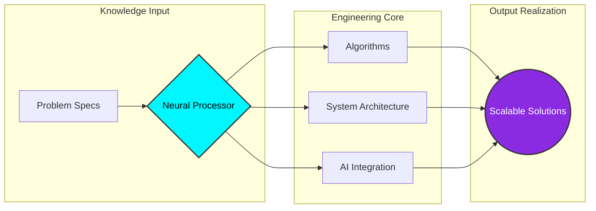

<!-- =========================================================================
     SOWMIYAN S - NEURAL ARCHITECT & AI ENGINEER
     "Pushing the boundaries of Agentic Systems & LLM Architectures"
========================================================================= -->

  

---

## 🛰️ CORE SYSTEM DASHBOARD

<table>
  <tr>
    <td align="center" width="33%">
      <b>SYSTEM STATUS</b> 
      
    </td>
    <td align="center" width="33%">
      <b>NEURAL LOAD</b> 
      
    </td>
    <td align="center" width="33%">
      <b>DEPLOYMENT</b> 
      
    </td>
  </tr>
</table>

---

## 🎨 THE ARCHITECT'S BLUEPRINT

---

## 🧠 COGNITIVE STACK

| Layer | Technologies | Power Level |
| :--- | :--- | :--- |
| **Logic Engine** | `C++`, `Java`, `Python`, `DSA` | `[██████████] 100%` |
| **Intelligence** | `LangChain`, `PyTorch`, `LLMs`, `NVIDIA NeMo` | `[████████░░] 85%` |
| **Interface** | `React`, `Next.js`, `Tailwind`, `Framer Motion` | `[███████░░░] 70%` |
| **Infrastructure** | `Docker`, `Git`, `Linux`, `AWS` | `[████████░░] 80%` |

  

---

## 🧪 AI RESEARCH LAB (FEATURED PROJECTS)

<!-- PROJECTS_START -->

### 🚀 [Multi-Agent-Data-Analysis-System-with-CrewAI](https://github.com/sowmiyan-s/Multi-Agent-Data-Analysis-System-with-CrewAI)
- **Concept:** No description provided.
- **Core Tech:** Primarly built with Python.

  
  

### 🚀 [Java-Problem-Solutions](https://github.com/sowmiyan-s/Java-Problem-Solutions)
- **Concept:** Java DSA problems solved by me . Follow me on LinkedIn  @sowmiyan-s
- **Core Tech:** Primarly built with Java.

  
  

### 🚀 [GUARD-RAG](https://github.com/sowmiyan-s/GUARD-RAG)
- **Concept:** No description provided.
- **Core Tech:** Primarly built with Python.

  
  

### 🚀 [my-portfolio](https://github.com/sowmiyan-s/my-portfolio)
- **Concept:** No description provided.
- **Core Tech:** Primarly built with TypeScript.

  
  

### 🚀 [rin-chat-website](https://github.com/sowmiyan-s/rin-chat-website)
- **Concept:** No description provided.
- **Core Tech:** Primarly built with TypeScript.

  
  

<!-- PROJECTS_END -->

---

## 📊 QUANTUM ANALYTICS

  
  

  

  

---

## 🕹️ REAL-TIME ACTIVITY LOOP

  

---

## 🌐 BOUND BY CODE: THE MOTHERBOARD

  
<i>Joining forces to architect the next era of digital intelligence.</i>

  

    
    
    
  

---

## 📡 UPLINK (CONNECT)

  
  
  

  <b>&lt;/ ARCHITECTURE COMPLETE &gt;</b> 
  

